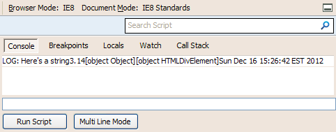
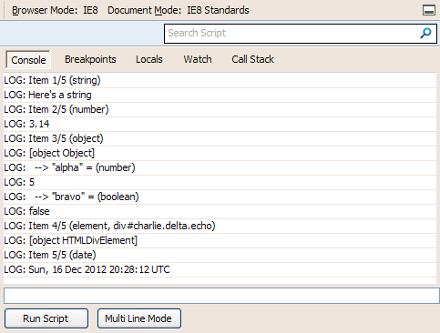

### All-in-one console.log wrapper

Just drop consolelog.js in your project and start passing data to `log()`. Whichever browser you're testing in, you'll see your data in the console &mdash; if the browser doesn't have a console, Firebug Lite will load. You can pass any variable type: strings, objects, arrays, functions, etc.

## Detailed print

This is an optional plugin to provide help information about the data that is being logged, especially in IE and older browsers. Just include consolelog.detailprint.js along with consolelog.js.

Firebug, WebKit's Developer Tools, and Opera's Dragonfly print useful, interactive items to the console:

Some browsers that have a primitive console &mdash; ones that does not expand arrays, links DOM elements to the source code, prints objects as "[object Object]" rather than listing their properties, etc.

Some cannot accept multiple arguments to a single `console.log` call. This includes IE 7/8/9/10, iOS 5 and older, and Opera 11 and older, among others.

Using the `detailPrint` companion plugin, special objects are presented in a more readable manner.

## Demo

[patik.com/code/console-log-polyfill/](http://cpatik.github.com/console.log-wrapper)

## Documentation

[patik.com/blog/complete-cross-browser-console-log/](http://patik.com/blog/complete-cross-browser-console-log)
